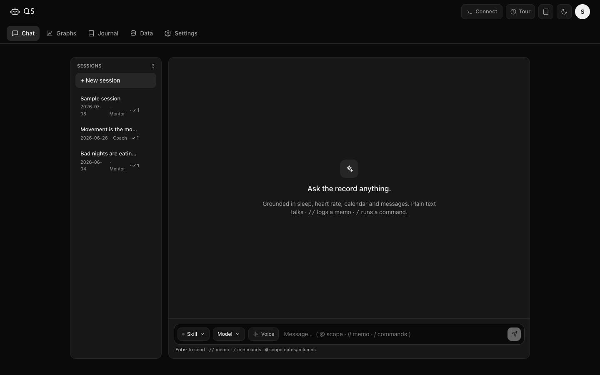
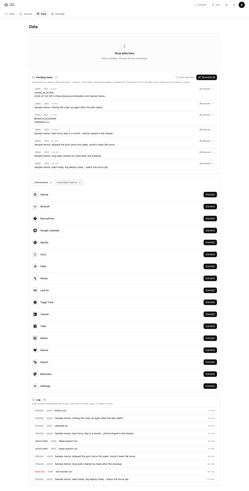

<h1 align="center">agentqs</h1>
<p align="center"><b>A journal that builds itself — and the best mentor and therapist you've ever had.</b></p>
<p align="center">It knows everything about you. It finds your patterns, helps you replicate what works, keeps you on your good habits, and gives you real clarity and awareness over your own life.</p>

<p align="center">
  <a href="https://flowengine.cloud/deploy/agentqs">
    
  </a>
  &nbsp;·&nbsp;
  <a href="PLAN.md"><b>Read the story →</b></a>
</p>

---

You don't fill it in. You live your life, connect your sources, and talk to it like a friend — and the record **builds itself.** Then ask it anything and get an answer grounded in **your** numbers, not generic advice.

- ✅ **Talk to your life** — "why have I felt off this week?" → an answer from your actual sleep, heart rate, calendar and messages
- ✅ **Every source, one record** — Apple Health, calendar, Spotify, GitHub, browsing, iMessage, WhatsApp, location — merged into one daily table
- ✅ **Capture anything** — type it, drop a file, or hit record for a voice memo; turn it into structured data with one click
- ✅ **It remembers** — dated mentor sessions and the patterns that emerge across them build over time
- ✅ **Any AI provider** — Claude, OpenAI, Gemini. Paste your key and its live model list loads straight from the provider.
- ✅ **Built for Claude Code** — every screen shows its CLI command, API call, and MCP config

Runs on **your own server** and **your own AI key**. Your data lives in your own private git repo — nothing leaves except the questions you send your model.

---

## What you'd use it for

- **"Why am I tired / off / anxious lately?"** — grounded in the week's real signals, not a horoscope
- **Weekly review** — what changed, what correlated, what to try next week
- **Decisions with your own history** — "should I take this on? what happened last time I did?"
- **Spot your patterns** — "mood-9 days cost me +10 bpm and 47 minutes of sleep"
- **A journal that talks back** — capture a memo, get reflection, never a blank page

## Set up in 4 steps

Connect a source or two, ask your first question, and you're in. No terminal required — though it's right there if you want it.

| 1. Connect data | 2. Ask anything | 3. Capture | 4. Bring your AI |
|---|---|---|---|
|  |  |  |  |
| Link APIs or drop a file | Get a grounded answer | Type, voice-memo, or drag-drop | Paste any key — its live models load |

## Chat — your mentor

One conversation, Claude-Code style. Plain text talks to the mentor. `>>` logs a memo. `/` runs a command.

Or **start a live voice session** *(add an ElevenLabs key — config-gated)* — talk it out with a therapist grounded in the methodology *you* choose (CBT, ACT, schema, IFS…), or any mentor you build. It listens, reflects, and quietly **writes the key points back into your daily record.** No forms, no data entry — **the database builds itself from your conversations.**

Replies **stream in token-by-token** and always quote your real numbers — a grounded
answer lands with a **grounded in your record** badge and an inline **sparkline** of the
metric it cited (its shape over time, plus the latest / avg / range). Switch mentor any time.



## Journal — your life on one timeline

Every day in one place: metrics, memos, and the mentor session you had that day, side by side. Flip to a Notion-style table to show/hide, reorder and resize columns — then save the layout as a named view (like a **Sleep** view that shows only your sleep column). Your views are stored with your account and come back every time.


## Data — one pipe, all your sources

Connect apps, set a sync interval per source, and drop files into the inbox. Hit **Structure** to turn raw notes and exports into clean daily data — you only pay the AI when you press the button.



## Built for Claude Code

A Supabase-style bar on top surfaces the **CLI command** and **API call** for whatever you're viewing, plus one-click **Connect to Claude Code** (MCP). Drive your whole life record from the terminal.


## Integrations

One daily record, fed from wherever your life happens.

**Body & health**
- **WHOOP** *(roadmap)* — recovery, HRV and resting heart rate. The normalize → merge → rebuild pipeline is built and fixture-proven, but its OAuth connect flow isn't wired for a one-shot run yet, so the Data tab marks it **not-live** for now. The aim is per-minute heart rate off the app connection — "that meeting spiked me to 110," "this person costs me +10 bpm" — where most tools only ever see your daily average.
- **Apple Health** — steps, heart rate, sleep, workouts, energy.

**Focus & work**
- **RescueTime** — where your hours actually go
- **GitHub** — commits per day
- **Browsing** — what you read (Chrome/Firefox/Safari history)
- **iPhone backup** *(roadmap)* — a backup snapshot (files + domains) lands today; per-app screen time, calls and messages are the next step

**Life**
- **Google Calendar** — meetings, and how they land on your body
- **Spotify** — what you listened to
- **Notion** — your journals and notes (drop an export)
- **WhatsApp / iMessage** — conversation history (iMessage reads your local `chat.db`; WhatsApp via a chat export)
- **Location** — where you were (OwnTracks live, or a Google Timeline export)

**Anything else** — drag-drop any CSV, text export, or screenshot. The agent works out what it is and structures it. No importer required.

## Run locally

```bash
cp .env.example .env       # AI key optional — add providers in the UI
npm install
npm run dev                # → http://localhost:3000
```

Embeddings run on a local model out of the box — no key, no cost, nothing to set up. Semantic search ("find days that felt like this") works on first run.

## Self-host with Docker

The container runs the full app — UI, mentor, API syncs, bots, scheduler. Two things to know about **file-based** sources (Chrome history, iPhone backup), because those live on *your* machine, not in the container:

```bash
docker run -d \
  -v ~/agentqs-data:/data \                                  # your record + SQLite (persist this)
  -v "$HOME/Library/Application Support/Google/Chrome:/host/chrome:ro" \  # optional: local file sources
  -e ANTHROPIC_API_KEY=sk-... \
  -p 3000:3000 agentqs
```

- **Docker on the machine that has your data** (your Mac, a NAS): mount those paths read-only (the importer probes `/host/chrome/Default/History`) and agentqs reads them directly.
- **Docker on a remote server** (VPS, Coolify): the container can't reach your laptop's files. Run the local daemon on your machine — `npm run daemon -- run --push` imports your file sources and commits + pushes them into your record repo, and the server pulls. **Git is the sync layer**, so the remote instance still sees everything.
- API sources (WHOOP, Calendar, GitHub…) work anywhere — no local machine needed.

## The record (source of truth)

Your life lives as **plain text in a git repo** — human-readable, diffable, and importable by a script in any language. The SQLite database is just a **rebuildable cache** (never committed); the record is the truth.

```
record/
  daily/<source>.csv   one wide CSV per source, first column `date`
  inbox.jsonl          one raw capture per line (the pending bucket)
  sessions.jsonl       one mentor/therapy session per line
```

Each `daily/*.csv` is melted into long form — `(date, source, metric, value)` — so any new source, or any CSV you drop in, adds its columns with **zero schema migration**.

Rebuild the cache from the record any time — it's pure, so the same record always yields the same database:

```bash
npm run rebuild            # rebuild ./data/agentqs.db from ./data/record
npm run rebuild:verify     # build the sample record twice, prove the bytes are identical
```

## Importers

Each source is a small script behind the record contract: fetch → normalize →
write one `daily/<source>.csv` → rebuild. **GitHub** (commits/day) is the first,
live end to end:

```bash
# your own commits — token from --token, GITHUB_TOKEN, or the Data tab
npm run import:github -- --token ghp_xxx --rebuild

# any public author, no token needed
npm run import:github -- --login torvalds --days 30 --record /tmp/rec --rebuild

# offline: run the same normalize → write → rebuild path against a fixture
npm run import:github -- --fixture samples/github-commits.json --login demo \
  --from 2026-06-01 --to 2026-06-14 --record /tmp/rec --rebuild
```

It pulls commits from the GitHub Search API, buckets them by author-date into a
dense per-day series, and merges them into `record/daily/github.csv`. In the app,
the **Data** tab does the same with one click (paste a token → real commits land
in your record and rebuild into the daily table).

### Tier-1 plugins — RescueTime · Google Calendar · Spotify · WHOOP

The rest of the Tier-1 APIs live behind one shared **plugin** interface
(`src/lib/importers/plugin.ts`): `credential → fetch a window → normalize into a
wide daily table → merge into record/daily/<id>.csv → rebuild`. Adding a source is
one file plus a registry entry — no new route, no new UI. They all share the
generic `/api/import/[source]` route and the `SourceConnect` Data-tab row (paste a
credential → sync → sparkline + interval), and one CLI:

```bash
# RescueTime uses a simple API key; Calendar / Spotify take an OAuth access token
npm run import:source -- --source rescuetime --credential <key> --rebuild
npm run import:source -- --source spotify --credential <token> --days 30 --rebuild

# offline: run the real fetch → normalize → merge → rebuild path against a fixture
npm run import:source -- --source gcal --fixture samples/gcal-events.json \
  --from 2026-06-01 --to 2026-06-30 --record /tmp/rec --rebuild
```

| Source | Auth | Daily metrics |
|---|---|---|
| **RescueTime** | API key | `productivity_pulse`, `productive_hours`, `distracting_hours`, `total_hours` |
| **Google Calendar** | OAuth token | `meetings`, `meeting_hours` |
| **Spotify** | OAuth token | `tracks`, `minutes` |
| **WHOOP** *(stub)* | OAuth token | `recovery`, `hrv`, `resting_hr` |

WHOOP is a **stub adapter**: its normalize → merge → rebuild pipeline is real and
fixture-provable, but its OAuth flow isn't configurable in a single run, so the
Data tab marks it *not-live* until that lands (a later loop).

### Tier-2 file importers — Chrome history · iPhone backup

Some sources aren't an API — they're a file on **your own machine** (a Chrome
`History` SQLite, an iPhone backup) that a remote/Docker instance can't reach.
These live behind a sibling contract (`src/lib/importers/file-plugin.ts`): `local
file → read a window → normalize into a wide daily table → merge into
record/daily/<id>.csv → rebuild`. Same idempotent write, same daily table the
mentor reasons over. Because the reader touches your disk they run **locally**
(the CLI / daemon), never on the server:

```bash
# Chrome browsing history — visits, pages, domains per day.
# Omit --path to probe the default profile location for your OS.
npm run import:file -- --source chrome --rebuild
npm run import:file -- --source chrome --path "~/Library/Application Support/Google/Chrome/Default/History" --days 30 --rebuild

# iPhone backup (stub) — a snapshot row from an unencrypted Finder/iTunes backup.
npm run import:file -- --source iphone --path "~/Library/Application Support/MobileSync/Backup" --rebuild
```

Chrome copies the (locked) `History` file to a temp dir and reads the copy, so it
never touches the browser's own file, and converts Chrome's WebKit-microsecond
timestamps to days. **iPhone is a stub adapter**: it reads the backup's
`Manifest.db` and lands a real *snapshot* row (`files_backed_up`, `domains`) for
the backup's day — the per-domain call / iMessage / screen-time extraction isn't
wired yet, so the Data tab marks it *not-live*.

| Source | Reads | Daily metrics |
|---|---|---|
| **Chrome history** | `History` SQLite (`urls` + `visits`) | `visits`, `pages`, `domains` |
| **iPhone backup** *(stub)* | `Manifest.db` | `files_backed_up`, `domains` |

### Local daemon — ingest local files, then git-sync to the cloud

The daemon is the local loop that keeps file sources fresh and hands them to a
cloud replica. **Git is the sync layer**: the daemon commits your record repo on
your machine, the cloud instance pulls it.

```bash
npm run daemon -- ingest          # run every file importer found on THIS machine → rebuild
npm run daemon -- sync            # git add + commit the record repo (--push to send upstream)
npm run daemon -- run --push      # ingest, then commit + push in one shot
```

`ingest` probes each importer's default file locations, imports whatever it finds
(silently skipping the rest), and rebuilds the cache once. `sync` commits the
record and, only with `--push`, pushes it — so a remote/Docker agentqs sees your
Chrome history and everything else after it pulls, without ever reaching your
laptop's disk.

```bash
npm run files:test         # ships-when proof (Loop 12): the Chrome import command
                           # reads a real local History SQLite and lands per-day
                           # rows in the record + rebuilt daily table; the iPhone
                           # stub lands a snapshot; daemon sync commits the record.
```

### The agent brain — a mentor that queries your own record

With an AI key the mentor is a real **tool-using agent** (`src/lib/agent.ts`), built
on the **Vercel AI SDK** so it's provider-agnostic — default **Claude**, or paste an
OpenAI / Gemini key and the same agent runs on that model. It doesn't get your
numbers stuffed into its prompt; it **fetches them**, calling three tools until it
can answer:

- **`query_daily`** — runs a read-only SQL `SELECT` over your long/tidy `daily`
  table and gets the real rows back (the connection is read-only, so it can read the
  record but never mutate it).
- **`search_notes`** — FTS5 keyword search over your memos and past sessions for the
  qualitative context behind a number.
- **`find_similar`** — semantic search over the same text via the local embedding
  index (see below): finds days that *felt* like a described feeling even when they
  share no keywords. SQL for numbers, FTS for exact words, embeddings for vibe.

The chosen mentor (therapist, coach, or one you built) is the system prompt; a compact schema
catalog tells it what's queryable. So *"why have I felt off?"* makes it `SELECT` your
Apple Health sleep + heart rate, then reply *"sleep dropped to 6.1h and resting HR rose
to 61 bpm — your worst night in the window."* The reply **streams token-by-token** into the Chat tab
(NDJSON over the `curl -N` endpoint); when it closes, a **grounded in your record**
badge names the sources the tools touched and an inline **sparkline** plots a cited
metric over time.

With **no key**, a cross-source question is still answered deterministically from the
numbers (`src/lib/grounding.ts`) — two metrics from different sources are lined up on
their shared days and the relationship reported (e.g. *"commits run 13.25 on your
high-productivity days vs 3 on the low ones"*).

```bash
npm run agent:test         # ships-when proof: the agent calls the SQL + FTS tools
                           # and answers "why have I felt off?" citing a number that
                           # genuinely exists in the daily table

npm run integration:test   # keyless cross-source: GitHub + RescueTime + Calendar +
                           # Spotify feed one record, a question cites 2+ sources

npm run chat:test          # ships-when proof (Loop 5): boots the built app, logs in,
                           # and hits POST /api/chat like the Chat tab — asserts the
                           # reply streams in NDJSON delta frames and the closing frame
                           # carries ≥2 grounded sources + a sparkline of a cited metric

npm run smart:test         # ships-when proof (Loop 6): the shared smart-input contract
                           # routes `>>`/`/`/plain text; then over the built app `>> slept
                           # bad` lands in the inbox raw (no LLM, no daily row), `/sync`
                           # runs its live pipeline into the daily table, and the mentor
                           # chip switches mentor (mentor → therapist → coach)
```

## Sync engine — schedules, lazy-sync, stale badges

The **Data** tab lists every source with its type (`api` / `manual`), last-sync,
and a per-source **interval** dropdown (Manual · Hourly · Daily · Weekly). The
cadence is saved per user in `config.json` (`sourceIntervals`).

- **API sources auto-sync (lazy, on open).** When the Data tab opens, any api
  source whose interval has elapsed is **due** — the app runs it in the
  background, then refreshes the daily-table preview. Set **GitHub → Daily** and
  the next time you open the tab it re-pulls your commits with no click. (GitHub
  only auto-runs when a token is available, so it never loops on a failure.)
- **Manual sources get a stale badge.** A dropped/pasted source can't auto-sync,
  so when no fresh data has arrived within its interval it shows an amber
  **stale** badge — a nudge to refresh it. Manual sources are never "due".

The list is composed server-side (`src/lib/source-registry.ts`) from a registry
of known integrations plus any manual sources discovered in `record/daily/*.csv`;
the schedule math (`isDue` / `isStale`) is a pure, browser-safe module
(`src/lib/sources.ts`) shared by the API and the UI.

```bash
npm run sync:test          # ships-when proof: "GitHub: daily" is due on reopen,
                           # and an overdue manual source is flagged stale
```

## Structure — raw → daily

Anything you capture lands raw and free in the **pending inbox**: memos (`>>` in
Chat), and any CSV or text file you **drag-and-drop** (or Upload) onto the Data
tab. Nothing is parsed until you press **Structure** — that's the only place you
spend tokens, and only for prose.

- **Clean CSV / TSV → direct column map, no LLM.** The first date column becomes
  `date` (ISO), the rest become metrics, and it's merged into
  `record/daily/<source>.csv`. Deterministic and free.
- **Prose note → LLM.** The model extracts any dated metrics into the same wide
  shape, then merges the same way. Needs an AI key (Settings); if none is set,
  prose items stay pending and CSVs still structure for free.

Either way the cache is rebuilt and the new rows appear in the **daily table**
preview right below the inbox — long form `(date, source, metric, value)`, the
same table the mentor reasons over.

## Sessions — memory that carries

Every conversation is a **session**. When you end one (`/new`, or **+ New
session** in the Chat sidebar) it's distilled into a small **synthesis** —
`{title, summary, insights, commitments}` — and appended to
`record/sessions.jsonl`, the typed session store kept **separate from your daily
data**. With an AI key the model does the distilling; with no key a deterministic
heuristic lifts your explicit commitments and a plain summary from your own words
(it never invents insights).

That synthesis is the memory. When a **new** session opens, the mentor reads the
prior sessions' synthesis — summaries, insights, and open commitments, **never
the raw transcripts** — and picks up the most relevant open commitment
("last session you committed to X — how did that go?"). The transcript is still
stored for provenance, but the agent never reads it back.

Sessions surface as dated entries on the **Journal timeline**, side by side with
that day's metrics and memos — one storage layer (typed + synthesis), one merged
view.

```bash
npm run session:test       # ships-when proof: a new session references a prior
                           # session's commitment (no AI key required)
```

## Semantic search — find days that felt like this

Ask *"find days that felt like this"* and agentqs surfaces the days that **rhyme with
a feeling** — matched by meaning, not keywords. Type it in the box on the **Journal**,
ask it in **Chat**, or hit the API — *"wired, couldn't switch off"* still surfaces the
day you wrote *"anxious and stressed."*

It runs on a **local embedding model + sqlite-vec**, on by default with **nothing to
set up** — no key, no cost; it downloads a small model once, then runs fully offline:

- **The local model** (`src/lib/embed.ts`) is a real sentence-transformer —
  **all-MiniLM-L6-v2** (384-dim) running locally through transformers.js on the ONNX
  runtime — so *"the deploy finally went out and I could breathe"* lands near
  *"shipped, huge relief"* with no shared words and no hand-built lexicon. The quantized
  weights (~23 MB) download once into the data dir, then every run reads them from cache,
  offline. Private, no key. It's pluggable behind one `embed()` seam — swap in an API
  embedder later and bump the model id to reindex.
- **sqlite-vec** (`src/lib/embeddings.ts`) stores the vectors and runs the nearest-
  neighbour search inside SQLite. It self-heals: the index is a separate derived file
  (never committed, kept out of the byte-deterministic main cache) that rebuilds
  whenever your record or the model changes. If the loadable extension can't load on
  some host, the same vectors are ranked by a pure-JS cosine fallback — it never
  hard-fails.

Every memo and session synthesis is indexed with its date; a query collapses to the
best-matching **days**. SQL (`query_daily`) still answers numbers and FTS5
(`search_notes`) still answers exact keywords — embeddings add *vibe*. It all works
with **no AI key**; the mentor also calls it as the `find_similar` tool when a key is
set. Settings shows the index status and a one-click **Reindex**.

```bash
npm run semantic:test      # ships-when proof (Loop 15): the local model + sqlite-vec
                           # build an index from a seeded record and match days by
                           # MEANING (queries that share no words with the day they
                           # hit); then over the built app with NO AI key, /api/search
                           # returns the right day and Chat answers "find days that
                           # felt like this" grounded — all keyless.
```

## Voice — a memo you speak, and a session you talk

Two separate voice paths, both landing in the same record.

**Global mic → voice memo.** The mic in the top bar (every tab) records audio,
transcribes it, and drops the transcript **raw into your inbox** — no LLM, no
daily row, exactly like a typed `>>` memo. Structure it later like anything else.
Transcription is the only external step, and it's **pluggable**
(`src/lib/voice.ts`):

- **Local Whisper (default, private, no cost).** Point `WHISPER_BIN` at any
  command that takes an audio file path and prints the transcript — wrap
  whisper.cpp, faster-whisper, or a one-line shell script (`WHISPER_ARGS` passes
  extra args before the file). Preferred when set.
- **OpenAI Whisper (cloud fallback).** With no local binary, agentqs uses OpenAI
  Whisper if an OpenAI key is available (`OPENAI_API_KEY`, or your saved key when
  the provider is OpenAI).
- **No backend wired?** The mic stays config-gated — it explains what to set
  instead of recording, and `POST /api/voice/memo` returns a `501` with the hint.

**In-chat live voice session (ElevenLabs).** The toggle beside the chat input
starts a real-time voice conversation — premium voice + natural turn-taking, with
**Claude as the brain** (set the agent's LLM to Claude in the ElevenLabs
dashboard) and the session's key points written back to your record. It's
**config-gated**: a stub until both `ELEVENLABS_API_KEY` and `ELEVENLABS_AGENT_ID`
are set. Once configured, `POST /api/voice/session` mints the signed URL the
ElevenLabs Conversational AI widget connects to.

```bash
npm run voice:test         # ships-when proof (Loop 13): a local transcriber is
                           # wired, POST /api/voice/memo transcribes a recording,
                           # and the transcript lands in the inbox as a raw `voice`
                           # memo (no LLM, no daily row); the ElevenLabs in-chat
                           # session reports config-gated when unset.
```

## Channels — talk to your record from Telegram or Slack

Your mentor doesn't have to live in the browser. Point a **Telegram** or **Slack**
bot at your running instance and DM it — *"why am I so tired lately?"* comes back
with the same grounded answer the Chat tab gives, and `>> slept badly` still lands
raw in your inbox. It's the cloud replica's job: **message in → memo or grounded
chat → reply out.**

Every channel is the same channel-agnostic adapter
(`src/lib/channels/*`) — a thin shell around the shared reply brain
(`src/lib/reply.ts`, the exact `>>`-memo / grounded-chat logic the Chat box uses,
just non-streaming):

- **ingest** — verify the request came from the platform (a Telegram shared secret,
  a Slack signing-secret signature) and parse it into one normalized message.
- **composeReply** — the shared brain: a `>>` line is appended raw to the inbox
  (no LLM, no daily row) and acked; anything else is answered grounded — the
  tool-using agent with a key, the deterministic cross-source answer without one.
- **send** — post the reply back out via the platform's official API
  (Telegram `sendMessage` · Slack `chat.postMessage`).

Adding a channel is one small file plus a registry entry — the brain, the record,
and the grounding never change. Each is a webhook at `/api/channels/<channel>`:

```bash
# Telegram — create a bot with @BotFather, set TELEGRAM_BOT_TOKEN, then register:
curl "https://api.telegram.org/bot<token>/setWebhook?url=<host>/api/channels/telegram&secret_token=<secret>"

# Slack — set SLACK_BOT_TOKEN + SLACK_SIGNING_SECRET and point the app's
# Events API request URL at <host>/api/channels/slack (the url_verification
# handshake is handled automatically).
```

Channels are official APIs only — **WhatsApp will use the official Cloud API**, never
an unofficial bridge (data + ban risk). The transport carries the message; your
sensitive data never leaves your store.

```bash
npm run channels:test      # ships-when proof (Loop 14): a Telegram DM "why tired?"
                           # is grounded against a real 2-source record and the
                           # reply is posted back out via the Bot API; the identical
                           # Slack message gives the identical reply through the same
                           # adapter; a `>>` memo lands raw in the inbox (no LLM).
```

## Good to know

- **Private by design.** Your data lives in your own git repo and your own server. Nothing is sent anywhere except the slices you ask your model about. BYO key.
- **WHOOP is on the roadmap.** The daily recovery/HRV/resting-HR importer is built and fixture-proven; the OAuth connect and the per-minute stream (off your WHOOP app connection, not the limited public API) land next.
- **Local-first.** Everything works offline except API syncs and the messaging bots.
- **Cheap by design.** Raw capture is free; you only spend tokens when you press *Structure* or ask a question. Embeddings run locally.

MIT licensed. Full build plan in [PLAN.md](PLAN.md).
