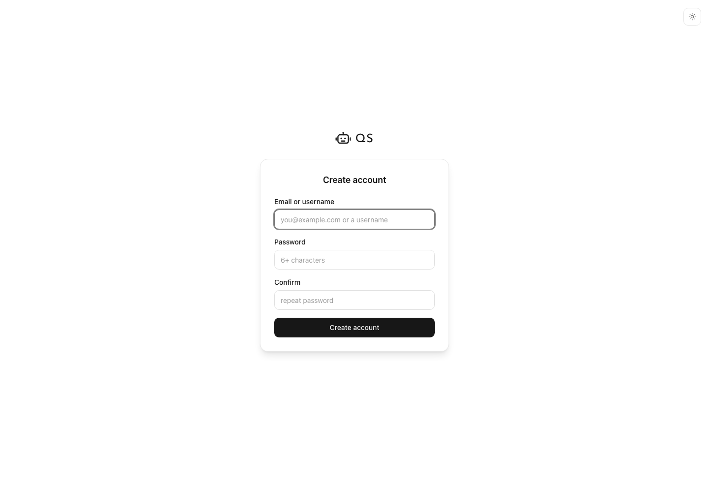
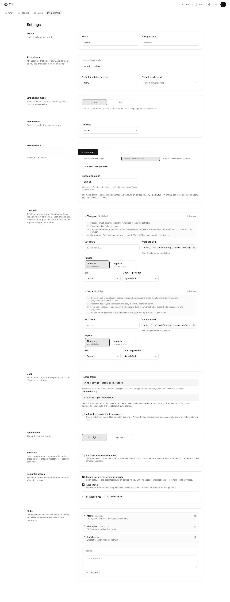

<p align="center">
  
</p>

<h1 align="center">agentqs</h1>
<p align="center"><b>A local-first journal that turns your life data into one queryable record.</b></p>
<p align="center">Capture notes, imports, sessions and metrics, then ask questions grounded in your own timeline.</p>

---

agentqs is a private journal + data workspace. It keeps raw captures, daily CSVs,
mentor sessions and a rebuildable SQLite cache on your machine, with optional AI
providers only when you choose to connect them.

- ✅ **One daily record** — notes, files, sessions and source metrics land in dated CSVs
- ✅ **Ask grounded questions** — Chat can query your record instead of guessing from a prompt
- ✅ **Structure when you decide** — raw captures sit in the inbox until you structure them
- ✅ **Local semantic search** — embeddings run on-device by default
- ✅ **CLI, API and MCP** — use the same core from the app, terminal, Codex or Claude Code
- ✅ **Bring your own model** — Anthropic, OpenAI, Gemini or compatible endpoints from Settings

Runs on **your own server** with **your own data directory**. Your record is plain
text and can live in a private git repo; derived databases and model caches stay
out of git.

---

## Set up in 4 steps

Create a local account, load demo data or start empty, connect sources, then ask
questions from the browser or a CLI agent.

| 1. Create account | 2. Chat | 3. Add data | 4. Configure |
|---|---|---|---|
|  |  |  |  |
| First visit creates the local login | Ask or log memos with `//` | Drop files, structure captures, connect sources | Add providers, local models, channels and sync settings |

## Journal

The Journal tab shows the rebuilt daily record as a table or timeline. The demo
record is 100 days of sample data across sleep, steps, mood, focus, screen time,
resting heart rate, workouts and commits.


## Data

The Data tab is the ingest surface:

- Drop a file or folder into the pending inbox.
- Press **Structure** for one item or **Structure all** for the inbox.
- CSV/TSV with a date column maps directly into daily rows without an LLM.
- Prose structuring needs an in-app AI provider unless you do the work from an
  external CLI agent through the CLI/MCP tools.
- Every capture appears in the Log so you can inspect structured, pending and
  rejected items.

Built-in source rows include GitHub, WHOOP, RescueTime, Google Calendar, Spotify,
Oura, Fitbit, Strava, Last.fm, Toggl Track, Todoist, Trakt, Notion, Deezer,
Swarm, Mastodon and Withings. Availability depends on the source: some use APIs,
some use OAuth tokens, and some are local-file or browser-automation imports.

## Chat

Chat has three input modes:

- Plain text asks the mentor about your record.
- `// slept badly, late deploy` logs a raw memo into the inbox.
- `/` runs commands.

With an AI provider configured, the app can use the Vercel AI SDK agent to call
record tools such as SQL over daily metrics, text search over memos/sessions and
semantic search. Without a provider, local deterministic paths still work for
basic record operations and some cross-source summaries.

## CLI and MCP

Install locally:

```bash
npm install
npm run build
npm link
```

Use the CLI directly:

```bash
agentqs journal --table --limit 30
agentqs import ./export.csv --name mood
agentqs structure
agentqs query "select date, value_num from daily where metric='mood'"
agentqs chat "what changed this week?"
agentqs sources
agentqs rebuild --verify
```

Expose the same core to Claude Code:

```bash
claude mcp add-json agentqs '{"command":"agentqs","args":["serve","--mcp"]}'
```

Codex, Claude Code and other CLI agents can operate agentqs through the CLI or
MCP tools. In that setup, **agentqs itself does not need to spend your configured
OpenAI/Anthropic/Gemini API key for the work the CLI agent is doing**; the agent
reads, writes, imports, queries and edits through local tools. In-app provider
usage only happens when you configure a provider in Settings and use web Chat,
web Structure, channels, or another app path that explicitly calls that provider.

## Run locally

```bash
cp .env.example .env      # optional; providers can also be added in Settings
npm install
npm run dev               # http://localhost:3000
```

On first visit, create the local account. The welcome dialog can seed generic
demo data; it is sample data and is marked as demo data.

## Docker

```bash
docker run -d \
  -v ~/agentqs-data:/data \
  -p 3000:3000 agentqs
```

Mount local file-source directories read-only if you want the container to read
things like browser history from the host. A remote container cannot read files
on your laptop unless you run a local ingest/daemon flow and sync the record.

## Record format

The plain-text record is the source of truth:

```text
record/
  daily/<source>.csv   one wide CSV per source, first column date
  inbox.jsonl          raw captures and structure status
  sessions.jsonl       mentor/session summaries
  photos.jsonl         photo metadata pointers, when photo import is used
```

SQLite databases, embedding indexes, model weights and thumbnails are derived
files under `data/` and are rebuildable.

## Useful Scripts

```bash
npm run rebuild
npm run rebuild:verify
npm run api:test
npm run semantic:test
npm run photos:test
npm run agent:test
npm run log:test
```

See `package.json` for the full test and importer list.

## Good to know

- **Private by default.** Data stays in your configured data directory. Model calls
  only receive what you ask the app or agent to send.
- **Local embeddings.** Semantic search uses a local model by default, so search
  indexing does not need an AI API key.
- **Token use is explicit.** Raw capture is local. Web Chat and prose Structure use
  a provider only after you add one. CLI-agent workflows can avoid app-side API
  usage by letting Codex or Claude Code do the reasoning through local tools.
- **Demo data is disposable.** The sample record is for first-run exploration and
  is cleared before real imports are mixed in.
- **License is restricted.** Free to use and modify, but not to sell as a product
  or hosted service.

## License

**Free to use. Not for sale.**

agentqs is licensed under [MIT with the Commons Clause](LICENSE): use it,
self-host it, change it and share it. You may **not** sell it or offer it as a
paid product or service, including paid hosting or paid support built on it.
