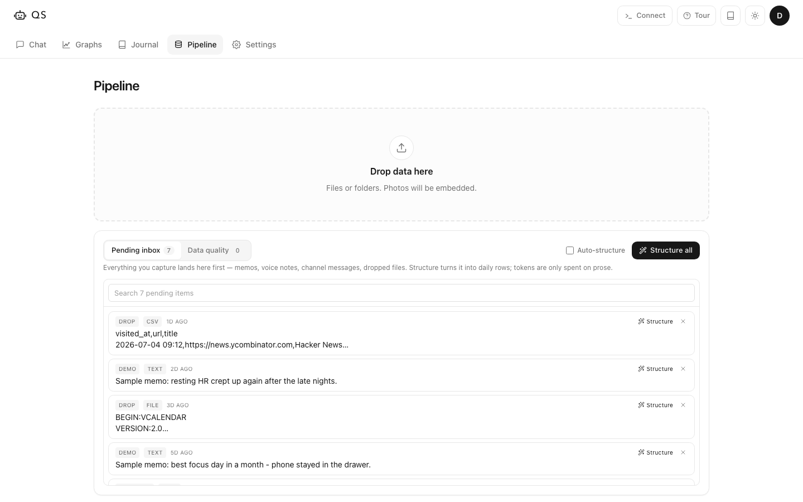
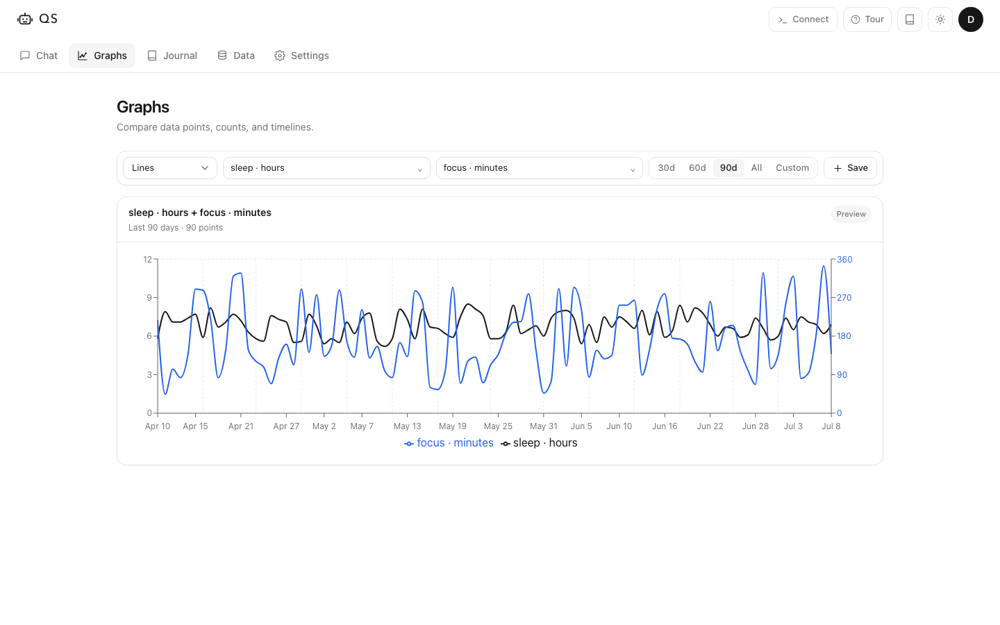

**The open-source pipeline for your personal data: 20+ apps synced into one place you can graph, chat with and learn from.**

[Quick start](#quick-start) · [Features](#features) · [Integrations](#integrations--data-pipelines) · [Storage](#how-your-data-is-stored) · [CLI & MCP](#cli-api-and-mcp) · [Deploy](#deploy) · [License](#license)

---

There are thousands of products helping companies use their knowledge bases and analytics. Our most important data stays neglected - every person has millions of data points recorded, tracking on purpose or not.

agentqs is the pipeline for it: connect 20+ apps, scrape the ones that lock your data in. It structures, indexes and embeds everything into one searchable record - ask it anything, or learn from it with graphs, AI with skills, or voice sessions. Works out of the box in the web app, CLI, Slack or Telegram.

## Quick start

agentqs is a CLI-first platform: the recommended (and free) setup needs no API keys and no environment variables. Clone the repo and ask Claude Code or Codex to set everything up for you.

```bash
git clone https://github.com/Ami3466/agentqs.git && cd agentqs
npm install
npm run dev               # → http://localhost:3000
```

The agent can import and structure the data already on your machine, connect your accounts and set up syncs.

If you want to interact with agentqs through external channels like Slack or Telegram, or build integrations on top of it, deploy it on the cloud.

[](https://flowengine.cloud/deploy/agentqs)

## Features

<table>
  <tr>
    <td width="25%"><a href="docs/images/pipeline.png"></a></td>
    <td width="25%"><a href="docs/images/journal.png"></a></td>
    <td width="25%"><a href="docs/images/graphs.png"></a></td>
    <td width="25%"><a href="docs/images/chat.png"></a></td>
  </tr>
  <tr>
    <td align="center" valign="top"><a href="#data"><b>Data</b></a><br/><sub>Pipelines: integrations, auto scraping, manual import, and Chrome extension for Google data.</sub></td>
    <td align="center" valign="top"><a href="#journal"><b>Journal</b></a><br/><sub>View your structured data. Edit and organize.</sub></td>
    <td align="center" valign="top"><a href="#graphs"><b>Graphs</b></a><br/><sub>Lines and correlations across any data points. Save the views.</sub></td>
    <td align="center" valign="top"><a href="#chat"><b>Chat</b></a><br/><sub>Add skills, chat with AI, or have a voice session.</sub></td>
  </tr>
</table>

### Journal

One daily record of everything: sleep, steps, mood, focus, screen time, workouts, commits - plain CSVs you own, as a table or a timeline. **Scan data** keeps it clean: duplicate columns merge, dead columns drop, messy values get fixed. One click each, all undoable. `agentqs audit` hands your AI agent the evidence for a deeper review - impossible dates, coverage holes, sources gone quiet, outlier values.

### Data

Connect a source, or drop any file and hit **Structure** - it lands in your record. Clean CSVs map instantly, no LLM. Every capture is logged: structured, pending or rejected, and everything is revertible. Click any source's name to jump to the Journal filtered to just its data (`/journal?source=<id>`).

### Graphs

Correlate anything - sleep vs focus, screen time vs mood - and save the views.

### Chat

Answers come from your actual data: SQL over metrics, text search over memos and sessions, semantic search over everything. `//` logs a memo, `/` runs a command.

### Skills

Give the AI a persona - mentor, coach, therapist, or your own prompt. Skills run in chat or voice sessions, grounded in your record, and save their insights and commitments back to it.

### Memos

Text or voice, from the app, CLI or a channel. They land in your inbox - structure them into daily rows or keep them as searchable notes.

### Channels

Slack and Telegram: log memos and ask your record questions from where you already are. They are capture channels, not scrapers - what you send the bot lands in your inbox, and your Slack history is never read. The Pipeline lists them under **Capture channels**, so a bot you haven't linked yet never looks like a broken data source.

## Integrations / data pipelines

**Connect by API or OAuth** - GitHub · Whoop · Oura · Fitbit · Withings · Strava · RescueTime · Toggl Track · Todoist · Google (Calendar, Gmail) · Spotify · Last.fm · Deezer · Trakt · Notion · Swarm · Mastodon · Granola\*

**Google is one connection.** One account, one key, and you tick what it imports - Calendar, and Gmail down to Inbox and Sent separately. The scope Google is asked for is only what you ticked, so if you never want Gmail you are never asked for your mail; tick it later and it re-authorizes the *same* key. Gmail counts, it never reads: message IDs only, landing `emails_received` and `emails_sent` per day. The products Google gives no API for - Search, Maps, YouTube, Gemini - come in through the Chrome extension under Automated imports instead. (Google Drive backup is not a source: backups send data out, and never appear in the pipeline.)

OAuth sources (Google, Spotify, Fitbit, Strava, Whoop, Withings, Trakt) connect with Authorize - register the redirect URI the form shows, paste client id + secret, approve. Every sync mints a fresh token from there on. Syncing lands only the rows it fetched: an import never re-reads your whole record, so a hosted instance stays responsive no matter how big the record gets.

**Every source is read to the end.** Each importer follows its API's pagination to the last page rather than taking the first one and stopping, asks about every year back to 2000 (a quiet stretch in your life is not the end of it), and refuses to write a partial answer as if it were the whole one. A source that lands nothing on its first import fails loudly instead of reporting success.

**Connecting a source imports its history, not the last 90 days.** The first sync of a source takes everything the API will give (years, not a window); every sync after it resumes from the last day you already have, so nothing is re-fetched and nothing is left behind. Slow is not a ceiling: Gmail is counted one day at a time, so its first import walks your whole account year by year and can run for minutes - it runs in the background and saves each year as it lands. Where an API has a hard ceiling the row says so instead of looking broken - Spotify only ever returns your last ~50 plays, so a sync covers a few days and your listening history comes from their account export. Drop that export in (or `agentqs source file spotify --path my_spotify_data.zip`) and it fills the same Spotify source, so one row shows the lifetime while the sync keeps the last few days fresh.

**Every connection shows its receipts, and clicking one opens its data.** A connected row carries a Connected badge, *which* account it is authorized as (so two Whoop athletes are never twins), what actually landed (days, events, date range) and when it last synced - all counted from the record, so a connected-but-empty source reads "no data yet" instead of passing for a healthy one. Click the row and the Journal opens filtered to that source alone: "what did this give me?" is one click, never a guess.

**"Connected" means a key is stored - nothing else.** A CSV you dropped, a Takeout archive you unpacked, a history file read off your disk: those are **Imported** and **Local file**, and they say so. They are still yours to filter and remove - they just have no account behind them and nothing syncs them. Only a row with a real credential gets the Connected badge, so the list answers "what is actually live?" at a glance instead of showing you thirty green lights for files you dragged in once.

\* Granola has no API key - the credential is the desktop app's refresh token (`workos_tokens.refresh_token` in its `supabase.json`). Running agentqs on the same machine? It finds the login itself. Whoop connects two ways, and both ship: the official API (Authorize) for daily summaries, and the unofficial app login (email + password) - the only source of **per-minute heart rate**. Connecting Whoop imports its **entire history**, not a recent window - it finds where your data starts on its own, and later syncs resume from the last day you have (`agentqs sync whoop --all-time` re-runs a full backfill any time).

**Scrape with the Chrome extension** - the agentqs extension exports your entire Google MyActivity from a signed-in tab. Checkpointed: survives restarts and resumes on its own.

**Schedule scraping with Playwright** - for anything without an API: record the click-path to your data once, store the login, set an interval - it replays headless and lands like any other source. A Google MyActivity scraper ships out of the box.

**Import files** - drop anything: Google Takeout archives (calendar event titles land searchable) · Apple Health export.zip (steps, sleep, HR, workouts - lifetime, device-deduped) · Chrome and Safari browser history · Google Timeline · iPhone backups · Notion exports · Spotify data export · photos · any CSV, TSV, Markdown or text file. Point `agentqs import` at a whole folder and every file is accounted for - structured, landed raw, routed to its importer, or reported as residue in a saved receipt; nothing is silently skipped

Semantic search runs on local embeddings - no API key needed. Chat and structuring use whatever provider you add: Anthropic, OpenAI, Gemini or any compatible endpoint.

## How your data is stored

Everything lives in one data directory you own, in three layers:

- **The record - plain text, the source of truth.** `record/daily/*.csv` holds one row per day per source, numbers first - that's what Graphs and the Journal read. `record/events.jsonl` holds items - a meeting, a page visit, a track - one line each with title, text and link. Memos in `inbox.jsonl`, AI sessions in `sessions.jsonl`. Per-minute streams (WHOOP heart rate) are one small CSV per day, rolled up into daily columns.
- **Derived indexes - rebuildable, never committed.** A SQLite cache for SQL, a full-text index, on-device embeddings for semantic search, and a photo index. `agentqs rebuild` recreates all of them from the record, byte-identical.
- **The detail store (`detail.db`) - every point behind the rollups.** Streams too dense for one row per day - per-minute heart rate, every browser visit - live in a local SQLite as normal numeric tables, so chat and `agentqs query` correlate at full grain (`detail.heart_rate`). `daily` keeps one value per day; `detail` keeps them all.

Every new source follows the same rule: numbers go to daily columns; items with text (meetings, emails, messages) go to events, searchable by keyword and meaning; dense streams go to per-day files in the record and are indexed into `detail`, with a daily rollup; photos are indexed on-device. The same explainer lives in the app, behind the **?** next to the Journal, Graphs and Pipeline titles.

## CLI, API and MCP

Every action, no API key. Everything works from the terminal or any CLI agent:

```bash
agentqs chat "what changed this week?"
agentqs import ./export.csv --name mood
agentqs query "select date, value_num from daily where metric='mood'"
```

**No AI key? Use a CLI agent as the AI.** Everything the app does is reachable key-free: capture, import, sync, query, semantic recall (local embeddings), rebuild - and for the two flows that normally need a model, the agent does the reasoning itself:

```bash
agentqs inbox --json                      # pending captures, full text
agentqs structure --id <id> --csv "date,mood,steps
2026-01-05,8,14200"                       # the agent supplies the extracted CSV
agentqs recall "days that felt burned out" # meaning-search, fully on-device
```

Expose it over MCP - the agent reads, writes and queries through local tools (the repo's `CLAUDE.md` teaches these workflows automatically):

```bash
claude mcp add-json agentqs '{"command":"agentqs","args":["serve","--mcp"]}'
```

## Deploy

### Local

Keep your record outside the repo:

```bash
export AGENTQS_DATA_DIR="$HOME/agentqs-data"
npm run build
npm run dev
```

Your record is plain text (`record/daily/*.csv`, `inbox.jsonl`, `sessions.jsonl`) and can live in a private git repo. Databases and embeddings are derived - `agentqs rebuild` recreates them. By default the store lives in your platform's app-data folder, out of iCloud/Dropbox/OneDrive's reach - sync engines corrupt live stores. `agentqs doctor` checks yours; `agentqs migrate-store` moves an exposed one to safety.

### Docker

The repo ships a `docker-compose.yml` that builds the image, persists your record in a `/data` volume and passes provider keys through:

```bash
SESSION_SECRET=$(openssl rand -hex 32) docker compose up -d --build
```

Optional env: `ANTHROPIC_API_KEY`, `OPENAI_API_KEY`, `GOOGLE_GENERATIVE_AI_API_KEY` for chat and structuring. Local file sources (Chrome history, iPhone backups) only work when the container runs on the machine that holds the files - otherwise run the daemon there (`npm run daemon -- run --push`) and let the instance pull the record via git.

### Cloud

While the app is running it schedules its own syncs - set a source's interval and it happens, no setup. For times the app isn't open, one crontab line covers it: `0 * * * * agentqs sync --due` runs every source whose interval says it's due, browser scrapes included (copy it from Settings → API → Connect). `agentqs pipeline` shows the whole truth in one table: where each source's data comes from, credential provenance, what's scheduled, and whether the last run actually worked.

[**Deploy on FlowEngine**](https://flowengine.cloud/deploy/agentqs) - up 24/7, persistent storage at `/data`, syncs run around the clock.

[](https://flowengine.cloud/deploy/agentqs)

Any other host: mount storage at `/data`, set `AGENTQS_DATA_DIR=/data`, keep a stable `SESSION_SECRET`. Cloud can't read your laptop - for browser history, iPhone backups or photos, run the CLI on the machine that has the files.

## Good to know

- **Private by default.** Data stays in your data directory. Model calls only get what you ask to send.
- **Off-site backups built in.** `agentqs backup github --remote <url>` pushes a snapshot of your plain-text record to a private repo (files past GitHub's size limit are excluded and named, never silently dropped), and `agentqs backup drive` uploads the whole store as one AES-256-GCM-encrypted archive to your Google Drive on a schedule (`--schedule daily|off`, or the switches in Settings → Data) - `agentqs backup restore` brings either back. Backups are where your data is *kept*, not where it comes from: Google Drive here is a destination, so it never shows up among your data sources.
- **Token use is explicit.** Capture and search are local. AI runs only when you chat, structure prose, or run a channel - CLI-agent workflows skip it entirely.

## License

**Free to use. Not for sale.**

agentqs is [MIT with the Commons Clause](LICENSE): use it, self-host it, change it, share it. You may **not** sell it or offer it as a paid product or service, including paid hosting or support built on it.
